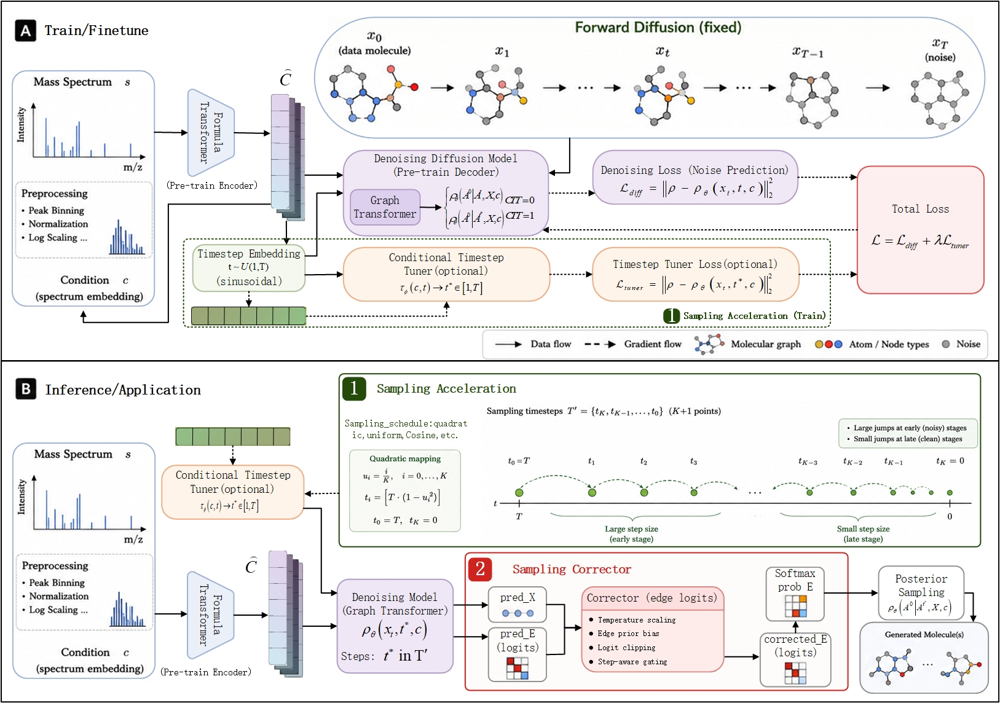
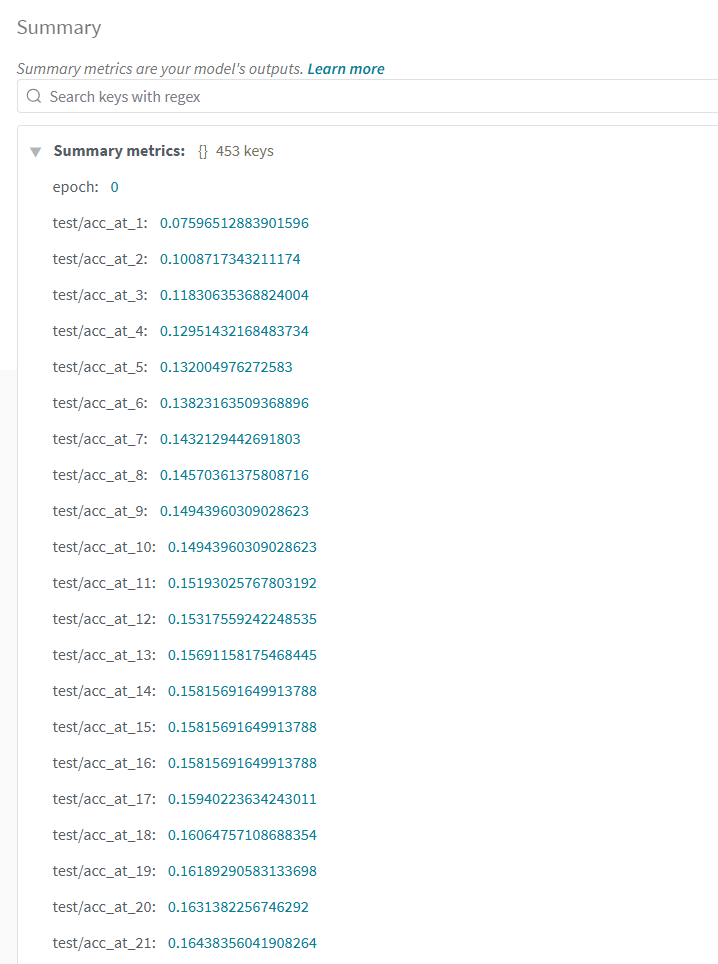

# ESDM

### ESDM: Efficient Spectrum-Conditioned Molecular Diffusion Models for molecular structure elucidation



# Environment Settings
This implementation is based on Python3. To run the code, you need the following dependencies:

- torch==2.3.1+cu118
- torch-geometric==2.3.1
- scipy==1.13.1
- numpy==1.23.0
- tqdm==4.67.1
- scikit-learn==1.6.1
- pytorch-lightning==2.0.4
- pandas==1.4.0
- omegaconf==2.3.0
- rdkit==2024.9.4
- wandb==0.24.0

Detailed environment configuration is in the [requirements.txt](requirements.txt) file.

# Usage
Case commands and parameters are in the [cmd_case.txt](others/cmd_case.txt) 

## Prepare data
Download dataset by run the [00_download_fp2mol_data.sh](data_processing/00_download_fp2mol_data.sh), [01_download_canopus_data.sh](data_processing/01_download_canopus_data.sh), [02_download_msg_data.sh](data_processing/02_download_msg_data.sh), and then run [03_preprocess_fp2mol.sh](data_processing/03_preprocess_fp2mol.sh), [build_fp2mol_datasets.sh](data_processing/build_fp2mol_datasets.sh) to get preprocessed data for trainning.

## Run experiment (train and test):

    PYTHONPATH=. python src/spec2mol_main.py \
      general.name=canopus_fs150_TT_C \
      dataset=canopus \
      general.test_only=checkpoints/canopus_fs150_TT_C/last-v1.ckpt \
      general.resume=null \
      general.load_weights=null \
      hydra.job.chdir=false \
      hydra.run.dir=. \
      dataset.datadir=/root/autodl-tmp/DMS/data/canopus \
      dataset.split_file=/root/autodl-tmp/DMS/data/canopus/splits/canopus_hplus_100_0.tsv \
      dataset.subform_folder=/root/autodl-tmp/DMS/data/canopus/subformulae/subformulae_default \
      dataset.labels_file=/root/autodl-tmp/DMS/data/canopus/labels.tsv \
      dataset.spec_folder=/root/autodl-tmp/DMS/data/canopus/spec_files\
      dataset.spec_features=peakformula \
      model.encoder_type=mist \
      general.encoder_finetune_strategy=null \
      model.use_ion_bias=false \
      model.ion_bias_alpha_init=0.00 \
      model.use_heavy_atom_bias=false \
      model.heavy_atom_alpha_init=0.00 \
      model.sampling_steps=100 \
      model.sampling_schedule=quadratic \
      model.use_sampling_corrector=true \
      model.use_per_sample_early_stop=false \
      model.use_multitraj_rerank=false \
      model.use_conditional_timestep_tuner=false \
      general.append_resume_suffix=false


## Result:


## Hyperparameter Analysis Experiment:

You could run the command (if you are interesting in our work, you could also reset some parameters in the [hyperparameter_search.py](src/hyperparameter_search.py) to change the rate of two modules for more hyperparameter_search experiment), and you could also run [visualize_hyperparameter_search.py](src/visualize_hyperparameter_search.py) to do some visualizes for it：

    python src/hyperparameter_search.py \
      --ckpt /root/autodl-tmp/DMS/checkpoints/canopus_fs100_org/last-v1.ckpt \
      --n-calls 20 \
      --test-samples 10

    python src/visualize_hyperparameter_search.py \
      --results-csv hyper_search_results.csv \
      --out-dir hyperparameter_plots

## Visualization of Some Case:

    

        
# Baselines links
* [DiffMS](https://github.com/coleygroup/DiffMS)

* The implementations of others are taken from the Pytorch Geometric library

# Acknowledgements
The code and filter learning code are implemented based on [DiffMS: Diffusion Generation of Molecules Conditioned on Mass Spectra](https://github.com/coleygroup/DiffMS).


# 📖 Citation

If you find this work useful, please cite our paper:

```bibtex

